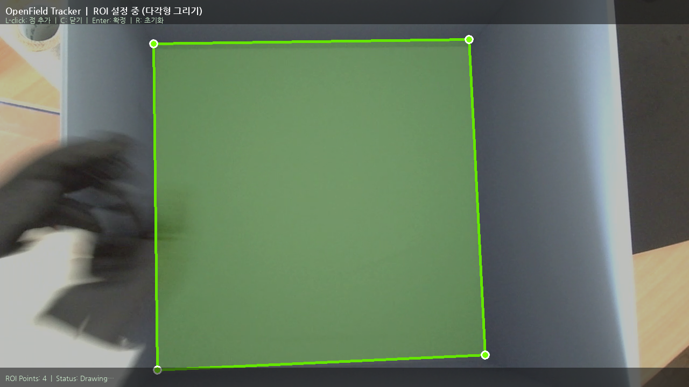
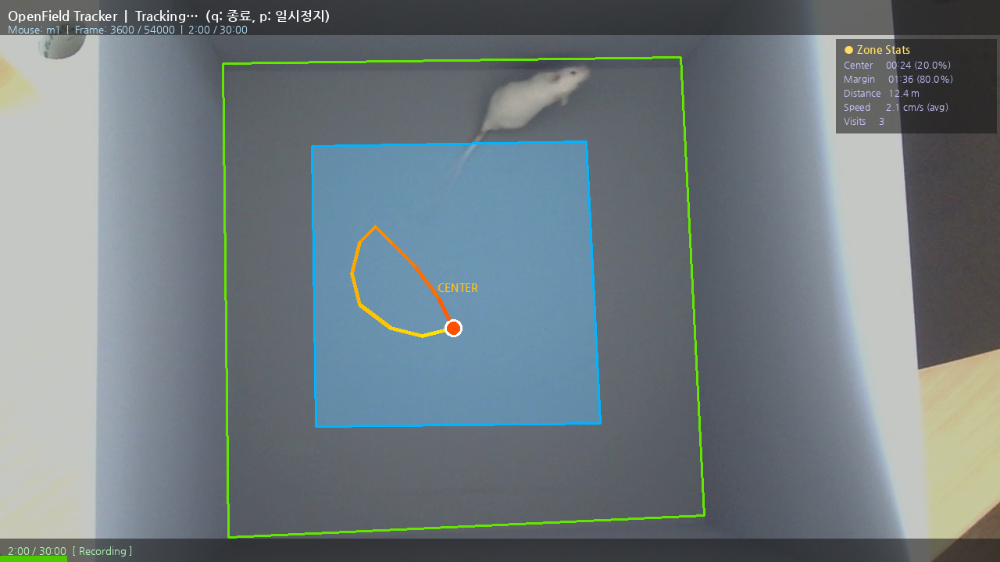
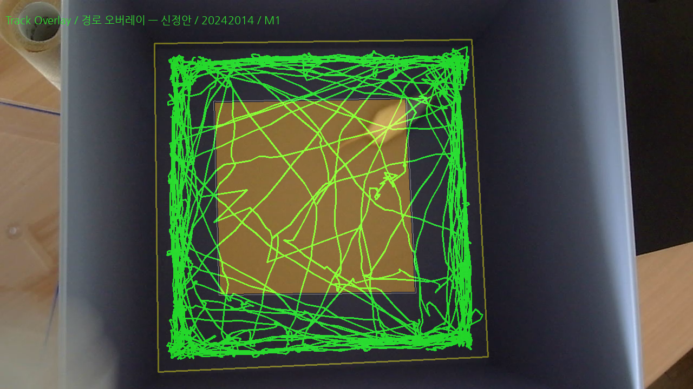
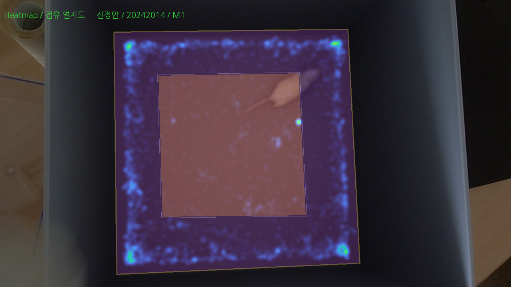
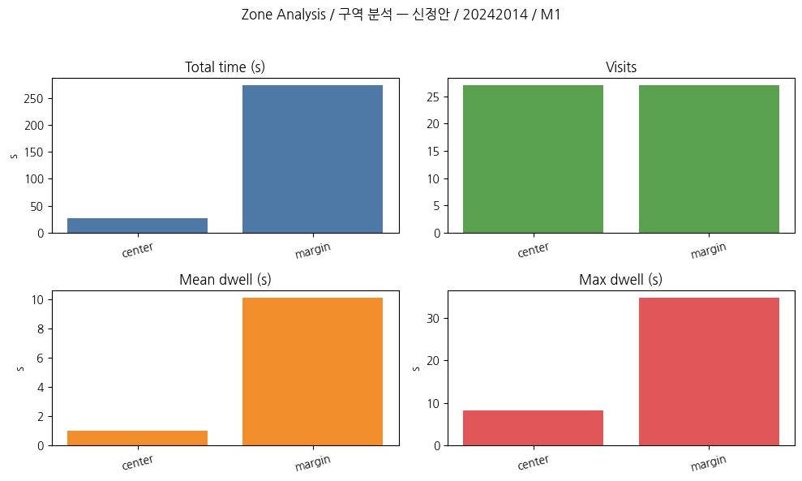
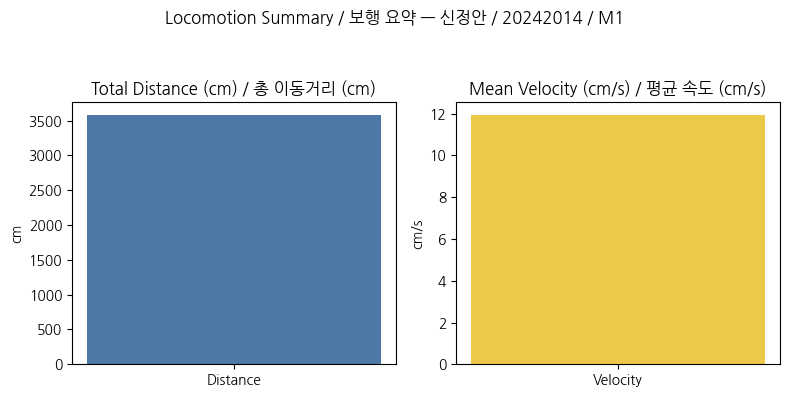
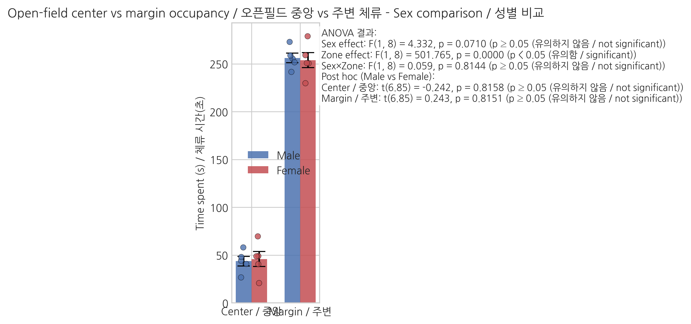
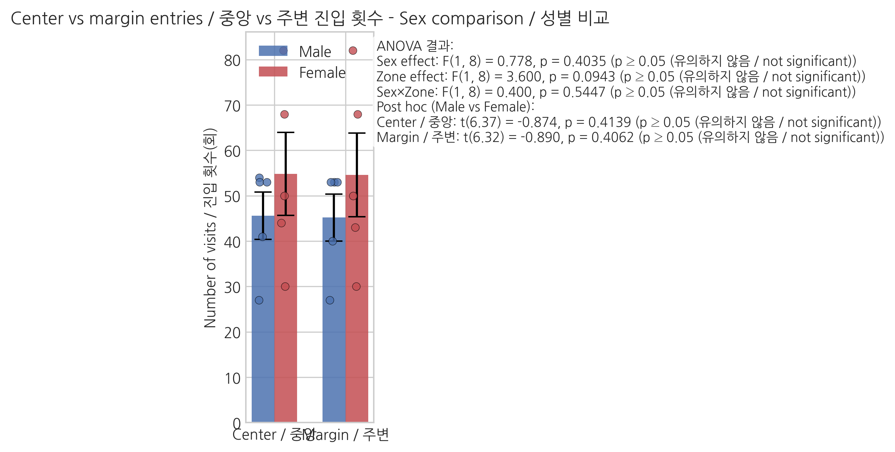
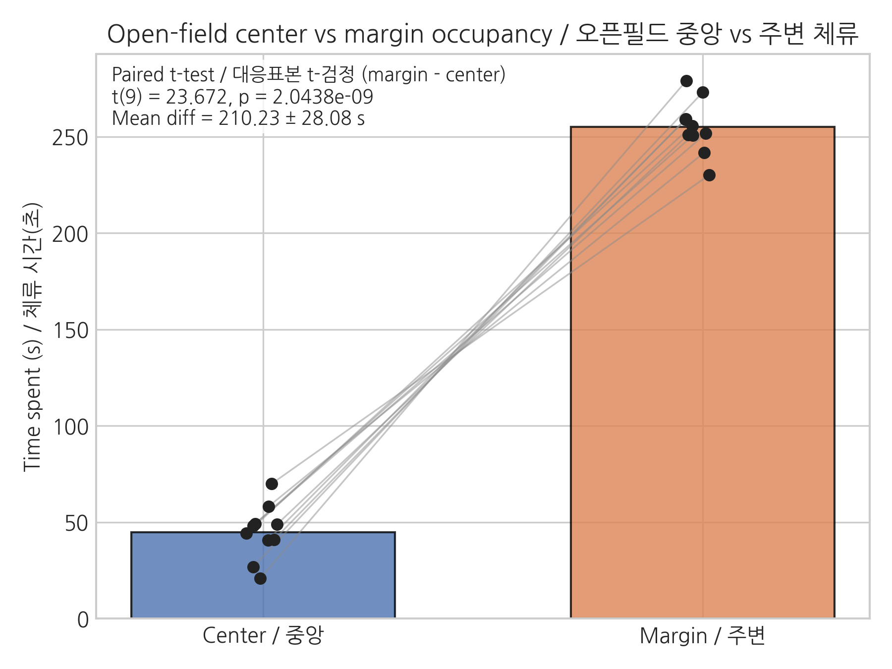

# OpenField Tracker (OFT)

**GitHub:** https://github.com/gdrpaul3-byte/hsmu_openfield-tracker_v1

마우스 Open Field Test 영상에서 자동으로 이동 경로를 추적하고, 구역별 체류 시간 및 운동량을 분석하는 Python/OpenCV 도구입니다.

---

## 프로그램 실행 화면

<p align="center">
  
  
</p>
<p align="center">
  <em>좌: ROI 설정 중 (다각형 그리기) &nbsp;|&nbsp; 우: 트래킹 중 (Zone Stats 실시간 표시)</em>
</p>

---

## 출력 그래프 예시

<p align="center">
  
  
  
  
</p>
<p align="center">
  <em>Track Plot &nbsp;|&nbsp; Heatmap &nbsp;|&nbsp; Zone Stats &nbsp;|&nbsp; Locomotion (마우스 m1 예시)</em>
</p>

<p align="center">
  
  
  
</p>
<p align="center">
  <em>Center 체류시간 &nbsp;|&nbsp; 방문횟수 &nbsp;|&nbsp; Center vs Margin 비교 (성별 집계)</em>
</p>

---

## 폴더 구조

```
openfield/
├── src/
│   ├── openfield_tracker.py        ← 메인 트래커 (ROI 기반 경로 추적)
│   ├── openfield_recorder.py       ← 영상 녹화 유틸리티
│   ├── locomotion_measure.py       ← 이동거리/속도 계산
│   ├── analyze_oft_locomotion.py   ← 운동량 분석 스크립트
│   ├── analyze_oft_zones.py        ← 구역 분석 스크립트
│   └── aggregate_oft_metrics.py    ← 전체 마우스 집계
├── archive/                        ← 이전 버전 (참고용)
├── data/
│   ├── videos/                     ← 원본 영상 (.mp4, gitignore 처리)
│   ├── tracks/                     ← 트래킹 결과 CSV
│   ├── configs/                    ← ROI/Zone/Calibration JSON
│   ├── plots/                      ← 분석 그래프 (.png)
│   └── student_submissions/        ← 학생 제출 파일 (.zip, gitignore 처리)
├── assets/
│   └── NanumGothic*.ttf            ← 한글 폰트
└── docs/
    └── screenshots/                ← 프로그램 실행 화면 캡처
```

---

## 환경 설정

```bash
conda activate opencv_312
# 또는
pip install opencv-python numpy Pillow pandas matplotlib
```

## 실행 방법

### 1. 트래커 실행 (영상 파일 지정)
```bash
cd openfield
python src/openfield_tracker.py --video data/videos/m1_oft.mp4
```

### 2. 트래커 실행 (대화형 - 이름/학번 입력)
```bash
python src/openfield_tracker.py
```
실행 시 이름, 학번, 마우스 ID를 입력하면 `data/videos/`에서 해당 파일을 자동으로 찾습니다.

### 3. 분석 실행
```bash
python src/analyze_oft_zones.py       # 구역별 체류 통계
python src/analyze_oft_locomotion.py  # 이동거리/속도
python src/aggregate_oft_metrics.py   # 전체 마우스 집계
```

### 주요 옵션 (openfield_tracker.py)
| 옵션 | 설명 |
|---|---|
| `--video PATH` | 영상 파일 경로 |
| `--roi PATH` | ROI JSON 파일 경로 |
| `--export-csv PATH` | 트래킹 결과 저장 경로 |
| `--method {bg,bright}` | 검출 방식 (배경차분 / 밝은 피사체) |
| `--font PATH` | 한글 폰트 경로 |

## 트래킹 조작 방법

**ROI 설정:** L-클릭(점 추가), R-클릭(되돌리기), C(닫기), Enter(확정)
**트래킹 중:** q(종료), p(일시정지/재개), `<`/`>`(스킵 배수 조절)

---

## 대용량 파일 안내

`data/videos/` 의 mp4 파일은 `.gitignore`로 제외됩니다. 영상 파일은 별도 공유 링크로 배포합니다.

## 의존성

```
opencv-python
numpy
Pillow
pandas
matplotlib
```
